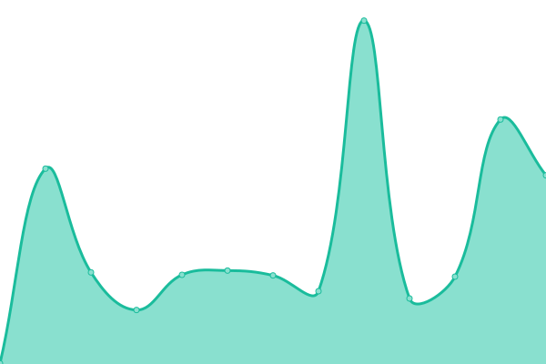

# [📈 Live Status](https://upptime.github.io/upptime): <!--live status--> **🟧 Partial outage**

This repository contains the open-source uptime monitor and status page for [Upptime](https://upptime.js.org), powered by [Upptime](https://github.com/upptime/upptime).

With [Upptime](https://upptime.js.org), you can get your own unlimited and free uptime monitor and status page, powered entirely by a GitHub repository. We use [Issues](https://github.com/upptime/upptime/issues) as incident reports, [Actions](https://github.com/upptime/upptime/actions) as uptime monitors, and [Pages](https://upptime.github.io/upptime) for the status page.

<!--start: status pages-->
<!-- This summary is generated by Upptime (https://github.com/upptime/upptime) -->
<!-- Do not edit this manually, your changes will be overwritten -->
<!-- prettier-ignore -->
| URL | Status | History | Response Time | Uptime |
| --- | ------ | ------- | ------------- | ------ |
|  [Website](https://www.phala.network/en/) | 🟩 Up | [website.yml](https://github.com/Leechael/phala-endpoint-uptime/commits/HEAD/history/website.yml) | 

 237ms
     
 | 

<a href="https://upptime.github.io/upptime/history/website">100.00%</a>
    

|  [Wiki](https://wiki.phala.network/en-us/) | 🟩 Up | [wiki.yml](https://github.com/Leechael/phala-endpoint-uptime/commits/HEAD/history/wiki.yml) | 

 151ms
     
 | 

<a href="https://upptime.github.io/upptime/history/wiki">100.00%</a>
    

|  [para1-api](http://para1-api.phala.network/) | 🟥 Down | [para1-api.yml](https://github.com/Leechael/phala-endpoint-uptime/commits/HEAD/history/para1-api.yml) | 

 0ms
     
 | 

<a href="https://upptime.github.io/upptime/history/para1-api">0.06%</a>
    

<!--end: status pages-->

[**Visit our status website →**](https://upptime.github.io/upptime)

## 📄 License

- Powered by: [Upptime](https://github.com/upptime/upptime)
- Code: [MIT](./LICENSE) © [Upptime](https://upptime.js.org)
- Data in the `./history` directory: [Open Database License](https://opendatacommons.org/licenses/odbl/1-0/)
